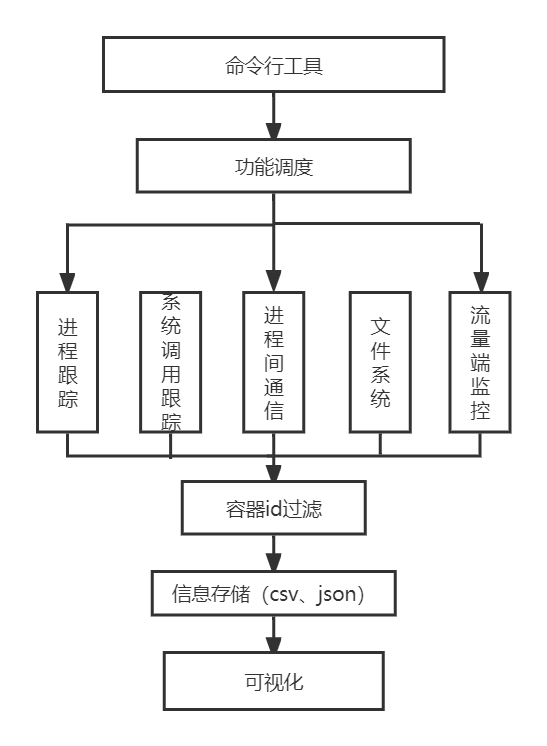

library:

- https://github.com/muellan/clipp
- https://github.com/danielaparker/jsoncons
- https://github.com/yhirose/cpp-httplib

# draft

## XXX （名字我还没想好

覆盖容器全生命周期的轻量级开源监控解决方案

- 开箱即用：以单一二进制文件或 docker 镜像方式分发，一行代码即可启动，包含多种 ebpf 工具和多种监测点；
- 作为守护进程运行，可自定义安全预警规则，也可以自动收集进程系统调用行为并通过 seccomp 进行限制；
- 可集成 prometheus 和 Grafana，作为监控可视化和预警平台；
- 可外接时序数据库，如 InfluxDB 等，作为信息持久化存储方案；
- 可通过 graphql 在远程发起请求并执行监控工具，将产生的数据进行聚合后返回，用户可自定义运行时扩展插件进行数据分析；

## 命令行工具

### 功能：

（cmd需要换成我们的最后的命名

1. 直接运行单一的 ebpf 工具，例如：

    ```
    ./cmd run tcpconnect [-c container_id] [-p PID] [-T second] 
    ```

    指定 container id 或容器名称或 pid 或 namespace，即可监控该容器下的 tcp 连接事件；

    ```
    ./cmd run tcpconnect [--fmt json]
    ```

    监控所有的 tcp 连接事件，并且以 json 格式输出

    每个子功能的参数可以自定义，参考 libbpf-tools

    除了 tcp 以外，还可以有：

    - syscall
    - ipc
    - file w/r

    还没做的：

    - perf event
    - （参考 libbpf-tools

2. 作为守护进程运行，记录日志（直接打印或者输出到某个文件

    ```
    ./cmd daemon [-c container id] [-p PID]
    ```

    监控某一个 docker id 或 process 的相关行为；

    自动对高危行为进行预警：比如调用了某些危险 syscall，读写了某些危险文件（这里的高危行为会硬编码在代码里，属于确定的高危行为，基本上会产生 docker 逃逸那种）

    ```
    ./cmd daemon [-c container id] [--config config.toml]
    ```

    通过 toml 用户定义可能的危险行为（syscall，文件读写），并产生日志预警；并且自定义需要追踪的部分，和时序数据库连接

    toml example：

    ```
    [tcpconnect]
    pid = 12345

    [process]
    interval = 10 # 10ms

    [danger syscalls]
    ....

    [database]
    ...
    ```


3. seccomp

    ```
    ./cmd daemon [-c container_id ] [-p PID] [--seccomp syscall_id_file] 
    ```

    加载配置文件，对 相应 pid 和 container 进行限制；

    ```
    ./cmd seccomp [-p PID] [-T 30] [-o file]
    ```

    对某个正常的程序追踪 30s 产生 syscall 表，用来给 seccomp 进行限制；

    ```
    ./cmd seccomp --source -sc [container id] -sp [PID] 
    --target -tc [container id] -tp [PID] 
    ```

    追踪某个正常的程序，并且把它的 syscall 通过 seccomp 应用限制到其他的可能被污染的 process 上面；

4. server

    ```
    ./cmd server [--prometheus] [--config file ...]
    ```

    作为 prometheus exporter 运行守护进程；

    ```
    ./cmd server [--listen 8080]
    ```

    在某个端口监听 http 控制请求，可以和我们自己的前端进行通信，，并且通过前端进行简单控制和查看网络连接图表（简单画几个按钮和图就好，一页就行？）；

## 以 docker 形式分发：

就是把上面的命令行工具做好

接下来还可以通过 go 和 cmd 通信，有留给用户编写插件的空间？

## 模块划分（类）：

1. tracker_manager：负责启动和停止 ebpf collector，并且和 ebpf collector 通信（每个 tracer 是一个线程）；

- start tracker
- stop tracker(remove tracker)

2. container_manager：负责观察 container 的启动和停止，在内存中保存每个 container 的相关信息：（cgroup，namespace），同时负责 container id 到 pid 的转换（提供查询接口

3. seccomp_manager: 负责对 process 进行 seccomp 限制

4. data_collector: 收集数据，再决定怎么办；传给 database 还是聚合还是交给别的地方还是打印

    collect_string
    collect_json
    collet_object

5. config loader: 解析 toml
6. cmd：解析命令行
7. server：http 通信

