## 系统测试

### 快速上手

从gitlab上clone本项目，注意，需要添加`--recursive`以clone子模块
```
git clone --recursive https://gitlab.eduxiji.net/zhangdiandian/project788067-89436.git
```
运行编译命令
```
sudo make install
```
编译完成后的所有可执行文件会在build目录下，eunomia可执行文件位于./build/bin/Debug/目录下，测试代码位于./build/test/目录下。使用
```
sudo ./eunomia run process
```
即可开启eunomia的process   
具体的命令行操作方法可以使用
```
sudo ./eunomia --help
```
进行查看

### 命令行测试情况

各项命令测试结果如下：

#### tracker系列命令

- process模块测试  
  - 追踪所有process
    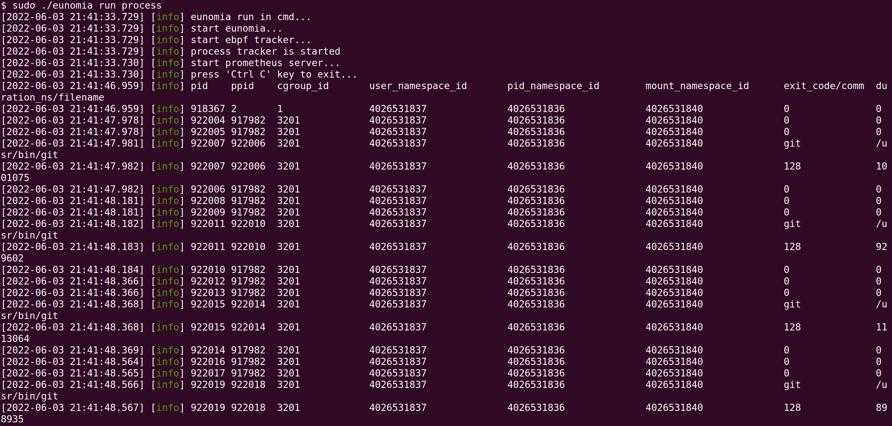
  - 追踪所有process并设置输出格式为csv
    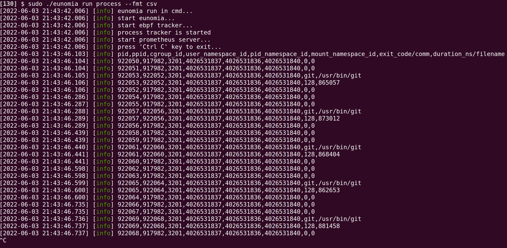
  - 追踪所有和id为7d4cc7108e89的容器有关的进程
    
  - 追踪pid为322375的进程，并设置10s后自动退出
    
  - 使用toml文件配置追踪参数(toml配置附在结果图后)
    
    
  - 开启process追踪模块的同时开启单独的容器监视模块，并将记录写到指定文件夹
    
    
- tcp模块测试
  - 追踪所有tcp
    
  - 追踪所有tcp并设置输出格式为csv
    
  - 追踪所有和id为7d4cc7108e89的容器有关的进程
    
  - 追踪pid为924913的进程，并设置15s后自动退出
    
  - 使用toml文件配置追踪参数(toml配置与process相同)
    
  - 开启process追踪模块的同时开启单独的容器监视模块，并将记录写到指定文件夹
    
    
- syscall模块测试
  - 追踪所有syscall
      
  - 追踪所有syscall并设置输出格式为csv
    
  - 使用toml文件配置追踪参数(toml配置与process相同)
    
  - 开启syscall追踪模块的同时开启单独的容器监视模块，并将记录写到指定文件夹
    
    
- files模块测试
  - 追踪所有文件读写
      
  - 追踪所有files读写并设置输出格式为json
    
  - 使用toml文件配置追踪参数(toml配置与process相同)
    
  - 开启files追踪模块的同时开启单独的容器监视模块，并将记录写到指定文件夹
    
    
  
- opensnoop模块测试
  - 追踪open()系统调用
    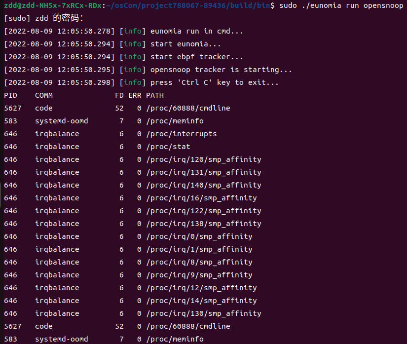
  - 使用toml文件配置追踪参数(toml配置与process相同)
    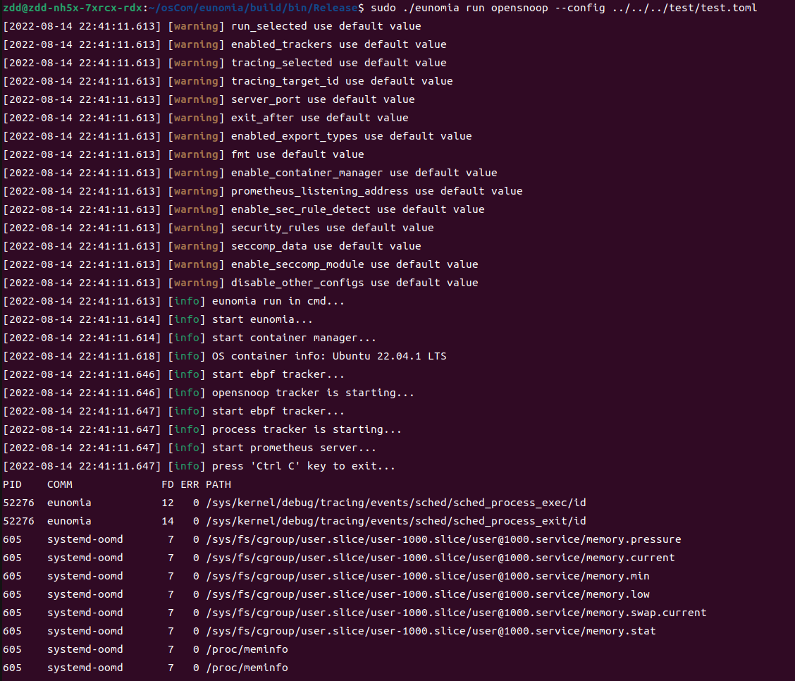
  - 开启opensnoop追踪模块的同时开启单独的容器监视模块，并将记录写到指定文件夹
    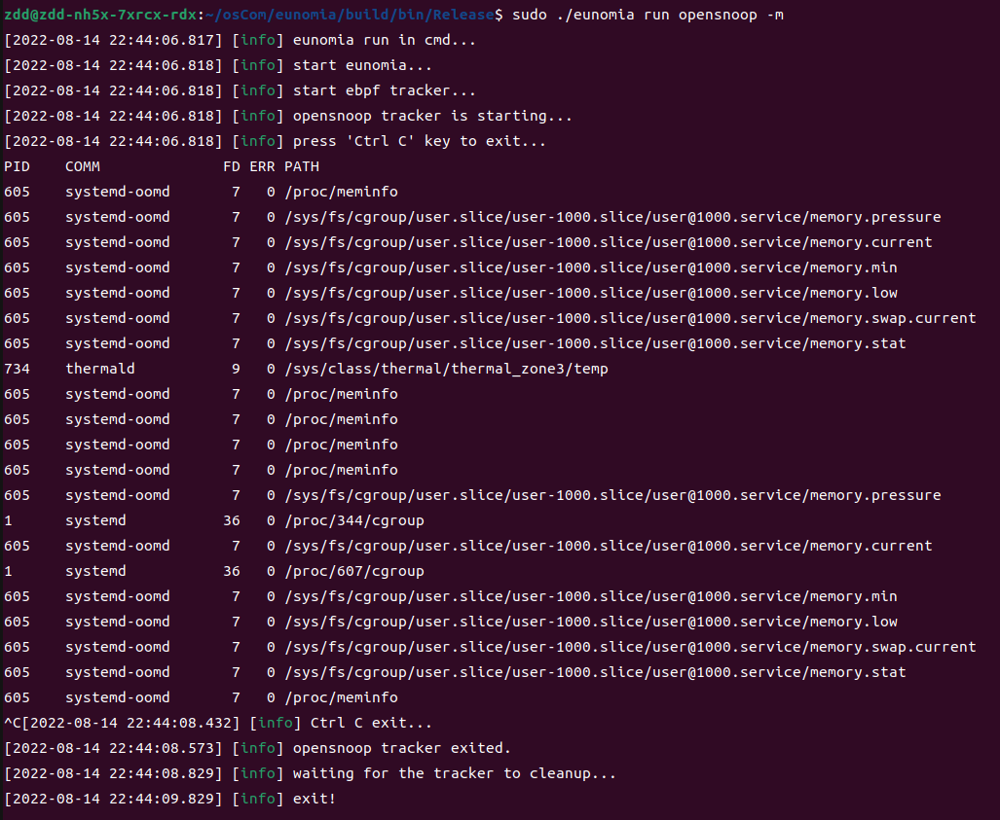

- mountsnoop模块测试
  - 追踪mount()和umount()
    
  - 开启mountsnoop追踪模块的同时开启单独的容器监视模块，并将记录写到指定文件夹
    
  
- sigsnoop模块测试
  - 追踪系统信号量
    
  - 使用toml文件配置追踪参数(toml配置与process相同)
    
  - 开启sigsnoop追踪模块的同时开启单独的容器监视模块，并将记录写到指定文件夹
    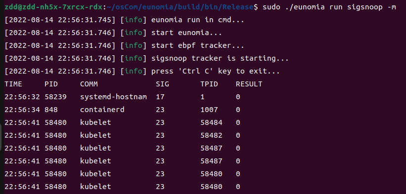

- tcpconnlat模块测试
  - 追踪tcp时延
    
  - 使用toml文件配置追踪参数(toml配置与process相同)
    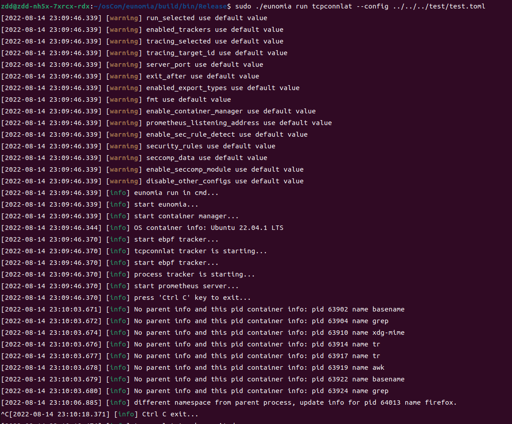
  - 开启tcpconnlat追踪模块的同时开启单独的容器监视模块，并将记录写到指定文件夹
    

- tcprtt模块测试
  - 追踪tcprtt
    
  - 使用toml文件配置追踪参数(toml配置与process相同)
    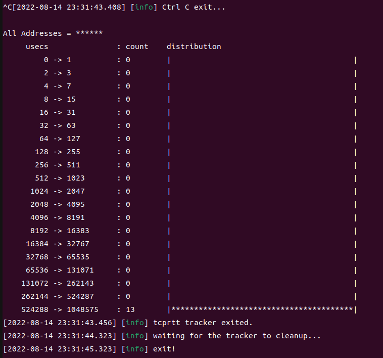
  - 开启tcprtt追踪模块的同时开启单独的容器监视模块，并将记录写到指定文件夹
    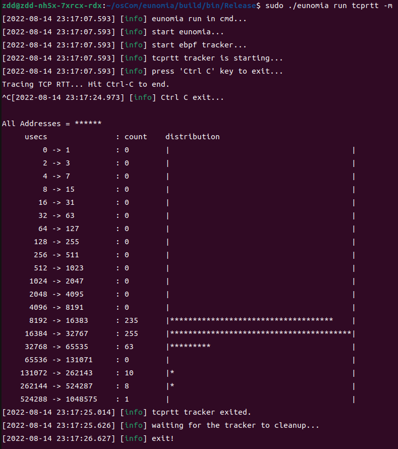

- capable模块测试
  - 追踪capabilities
    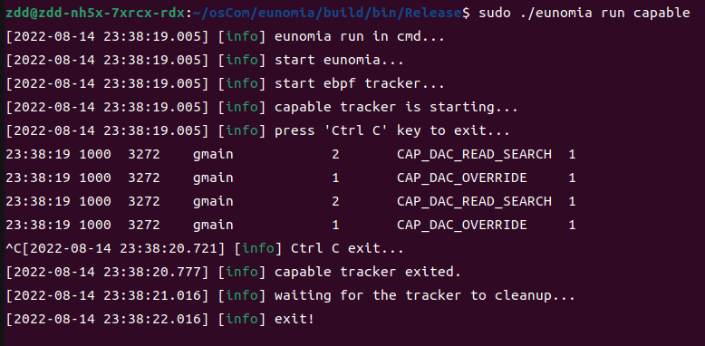
  - 使用toml文件配置追踪参数(toml配置与process相同)
    
  - 开启capable追踪模块的同时开启单独的容器监视模块，并将记录写到指定文件夹
    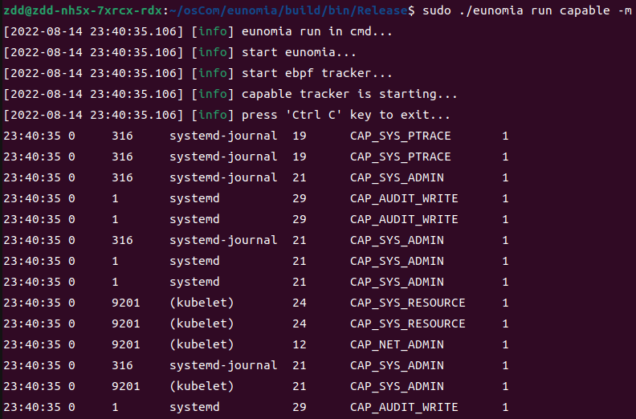

- oomkill模块测试
  - 追踪内存溢出
    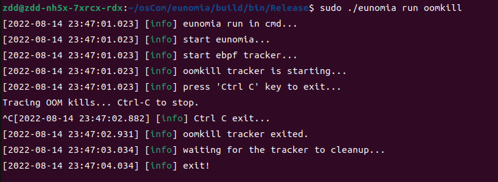
  - 使用toml文件配置追踪参数(toml配置与process相同)
    
  - 开启oomkill追踪模块的同时开启单独的容器监视模块，并将记录写到指定文件夹
    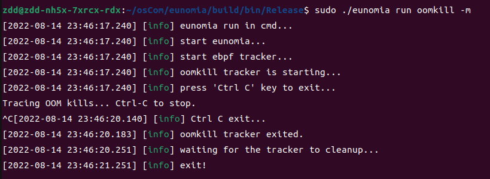


### 容器测试情况

- 测试进程与容器id互相映射
  

- 基于容器信息的可视化展示
  

### 信息可视化测试情况： prometheus and grafana
    
Grafana是一个开源的可视化和分析平台。允许查询、可视化、告警和监控的不同数据，无论数据存储在哪里。简单地说支持多种数据源，提供多种面板、插件来快速将复杂的数据转换为漂亮的图形和可视化的工具，另监控可自定义告警监控规则。Prometheus是高扩展性的监控和报警系统。它采用拉取策略获取指标数据，并规定了获取数据的API，用户可以通过exporter收集系统数据。

Eunomia能够将自定义的BPF跟踪数据导出到prometheus，它基于Prometheus-CPP这个SDK实现了prometheus获取数据的API，prometheus可以通过这些API主动拉取到自定义的BPF跟踪数据。具体来说，我们只需要在对应的tracker中嵌入BPF代码，运行Eunomia就可以实现导出BPF跟踪数据，而这些数据是可以被prometheus主动拉取到的，进而实现BPF跟踪数据的存储、处理和可视化展示。

Prometheus信息可视化测试：

  - 配置prometheus添加eunomia数据源
```
   job_name: "prometheus" 
     # metrics_path defaults to '/metrics'
     # scheme defaults to 'http'. 
     static_configs:
       - targets: ["localhost:9090"]
   job_name: "eunomia_node"
     static_configs:
       - targets: ["localhost:8528"] 
```
  - 从prometheus查看数据源的状态
    
  - 从promethesu查看eunomia暴露的指标列表
    
  - 从Prometheus查看部分指标的数值分布
    
    
    
- grafana

  - grafana配置从peometheus拉取数据的端口
    
  - grafana部分指标展示效果如下图，左上为文件读操作Bytes监控;左下为为系统调用热力图，方便定位到热点调用路径;右上为文件读操作TOP10;右下为文件写操作TOP10。
    
    

### CI/持续集成

我们在 github 上面部署了 github actions，包含自动集成、自动构建、自动测试等功能：


