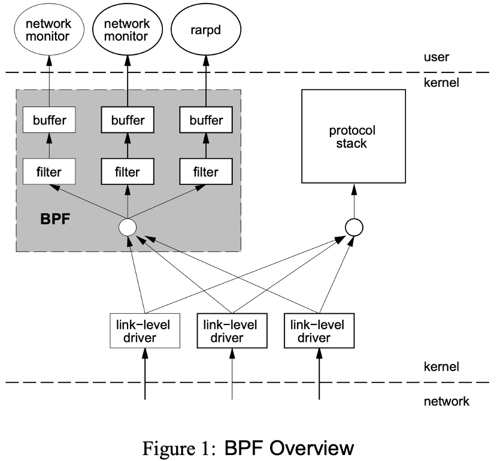
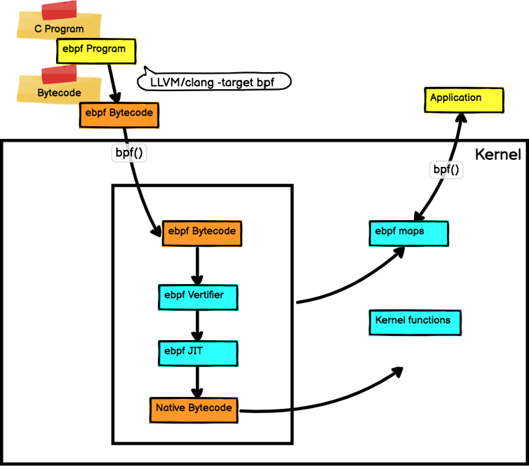

# eBPF 入门开发教程

<!-- TOC -->

- [1. 什么是eBPF](#1-什么是ebpf)
  - [1.1. 起源](#11-起源)
  - [1.2. 执行逻辑](#12-执行逻辑)
  - [1.3. 架构](#13-架构)
    - [1.3.1. 寄存器设计](#131-寄存器设计)
    - [1.3.2. 指令编码格式](#132-指令编码格式)
  - [1.4. 本节参考文章](#14-本节参考文章)
- [2. 如何使用eBPF编程](#2-如何使用ebpf编程)
  - [2.1. BCC](#21-bcc)
  - [2.2. libbpf-bootstrap](#22-libbpf-bootstrap)
- [3. 基于libbpf的内核级别跟踪和监控](#3-基于libbpf的内核级别跟踪和监控)
  - [3.1. process追踪模块](#31-process追踪模块)
  - [3.2. syscall追踪模块](#32-syscall追踪模块)
  - [3.3. file追踪模块](#33-file追踪模块)
  - [3.4. ipc追踪模块](#34-ipc追踪模块)
  - [3.5. tcp追踪模块](#35-tcp追踪模块)
- [4. seccomp](#4-seccomp)

<!-- /TOC -->

## 1. 什么是eBPF
        Linux内核一直是实现监控/可观测性、网络和安全功能的理想地方，
但是直接在内核中进行监控并不是一个容易的事情。在传统的Linux软件开发中，
实现这些功能往往都离不开修改内核源码或加载内核模块。修改内核源码是一件非常危险的行为，
稍有不慎可能便会导致系统崩溃，并且每次检验修改的代码都需要重新编译内核，耗时耗力。
加载内核模块虽然来说更为灵活，不需要重新编译源码，但是也可能导致内核崩溃，且随着内核版本的变化
模块也需要进行相应的修改，否则将无法使用。在这一背景下，eBPF技术应运而生。
它是一项革命性技术，能在内核中运行沙箱程序（sandbox programs），而无需
修改内核源码或者加载内核模块。用户可以使用其提供的各种接口，实现在内核中追踪、监测系统的作用。

### 1.1. 起源
        eBPF的雏形是BPF(Berkeley Packet Filter, 伯克利包过滤器)。BPF于
1992年被Steven McCanne和Van Jacobson在其[论文](https://www.tcpdump.org/papers/bpf-usenix93.pdf)
提出。二人提出BPF的初衷是是提供一种新的数据包过滤方法，该方法的模型如下图所示。   

        相较于其他过滤方法，BPF有两大创新点，首先是它使用了一个新的虚拟机，可以
有效地工作在基于寄存器结构的CPU之上。其次是其不会全盘复制数据包的所有信息，只会复制相关数据，可以有效地
提高效率。这两大创新使得BPF在实际应用中得到了巨大的成功，在被移植到Linux系统后，其被上层的`libcap`
和`tcpdump`等应用使用，是一个性能卓越的工具。
        传统的BPF是32位架构，其指令集编码格式为：
- 16 bit: 操作指令
- 8 bit: 下一条指令跳向正确目标的偏移量
- 8 bit: 下一条指令跳往错误目标的偏移量   

        经过十余年的沉积后，2013年，Alexei Starovoitov对BPF进行了彻底地改造，
改造后的BPF被命名为eBPF(extended BPF)，于Linux Kernel 3.15中引入Linux内核源码。
eBPF相较于BPF有了革命性的变化。首先在于eBPF支持了更多领域的应用，它不仅支持网络包的过滤，还可以通过
`kprobe`，`tracepoint`,`lsm`等Linux现有的工具对响应事件进行追踪。另一方面，其在使用上也更为
灵活，更为方便。同时，其JIT编译器也得到了升级，解释器也被替换，这直接使得其具有达到平台原生的
执行性能的能力。

### 1.2. 执行逻辑
        eBPF在执行逻辑上和BPF有相似之处，eBPF也可以认为是一个基于寄存器的，使用自定义的64位RISC指令集的
微型"虚拟机"。它可以在Linux内核中，以一种安全可控的方式运行本机编译的eBPF程序并且访问内核函数和内存的子集。
在写好程序后，我们将代码使用llvm编译得到使用BPF指令集的ELF文件，解析出需要注入的部分后调用函数将其
注入内核。用户态的程序和注入内核态中的字节码公用一个位于内核的eBPF Map进行通信，实现数据的传递。同时，
为了防止我们写入的程序本身不会对内核产生较大影响，编译好的字节码在注入内核之前会被eBPF校验器严格地检查。
eBPF程序是由事件驱动的，我们在程序中需要提前确定程序的执行点。编译好的程序被注入内核后，如果提前确定的执行点
被调用，那么注入的程序就会被触发，按照既定方式处理。  
        eBPF的整体执行逻辑由图1所示。


### 1.3. 架构
#### 1.3.1. 寄存器设计
        eBPF有11个寄存器，分别是R0~R10，每个寄存器均是64位大小，有相应的32位
子寄存器，其指令集是固定的64位宽。
#### 1.3.2. 指令编码格式
        eBPF指令编码格式为：
- 8 bit: 存放真实指令码
- 4 bit: 存放指令用到的目标寄存器号
- 4 bit: 存放指令用到的源寄存器号
- 16 bit: 存放偏移量，具体作用取决于指令类型
- 32 bit: 存放立即数

### 1.4. 本节参考文章

[A thorough introduction to eBPF](https://lwn.net/Articles/740157/)
[bpf简介](https://www.collabora.com/news-and-blog/blog/2019/04/05/an-ebpf-overview-part-1-introduction/)
[bpf架构知识](https://www.collabora.com/news-and-blog/blog/2019/04/15/an-ebpf-overview-part-2-machine-and-bytecode/)

## 2. 如何使用eBPF编程
        原始的eBPF程序编写是非常繁琐和困难的。为了改变这一现状，
llvm于2015年推出了可以将由高级语言编写的代码编译为eBPF字节码的功能，同时，其将`bpf()`
等原始的系统调用进行了初步地封装，给出了`libbpf`库。这些库会包含将字节码加载到内核中
的函数以及一些其他的关键函数。在Linux的源码包的`samples/bpf/`目录下，有大量Linux
提供的基于`libbpf`的eBPF样例代码。
一个典型的基于`libbpf`的eBPF程序具有`*_kern.c`和`*_user.c`两个文件，
`*_kern.c`中书写在内核中的挂载点以及处理函数，`*_user.c`中书写用户态代码，
完成内核态代码注入以及与用户交互的各种任务。 更为详细的教程可以参
考[该视频](https://www.bilibili.com/video/BV1f54y1h74r?spm_id_from=333.999.0.0)
然而由于该方法仍然较难理解且入门存在一定的难度，因此现阶段的eBPF程序开发大多基于一些工具，比如：

- BCC
- BPFtrace
- libbpf-bootstrap


等等，接下来我们将介绍其中较为典型的两种工具BCC和libbpf-bootstrap。
### 2.1. BCC
        BCC全称为BPF Compiler Collection，该项目是一个python库，
包含了完整的编写、编译、和加载BPF程序的工具链，以及用于调试和诊断性能问题的工具。
自2015年发布以来，BCC经过上百位贡献者地不断完善后，目前已经包含了大量随时可用的跟
踪工具。[其官方项目库](https://github.com/iovisor/bcc/blob/master/docs/tutorial.md)
提供了一个方便上手的教程，用户可以快速地根据教程完成BCC入门工作。
        用户可以在BCC上使用Python、Lua等高级语言进行编程。
相较于使用C语言直接编程，这些高级语言具有极大的便捷性，用户只需要使用C来设计内核中的
BPF程序，其余包括编译、解析、加载等工作在内，均可由BCC完成。  
        然而使用BCC存在一个缺点便是在于其兼容性并不好。基于BCC的
eBPF程序每次执行时候都需要进行编译，编译则需要用户配置相关的头文件和对应实现。在实际应用中，
相信大家也会有体会，编译依赖问题是一个很棘手的问题。也正是因此，在本项目的开发中我们放弃了BCC，
选择了可以做到一次编译-多次运行的libbpf-bootstrap工具。

### 2.2. libbpf-bootstrap
        `libbpf-bootstrap`是一个基于`libbpf`库的BPF开发脚手架，从其
[github](https://github.com/libbpf/libbpf-bootstrap) 上可以得到其源码。
`libbpf-bootstrap`综合了BPF社区过去多年的实践，为开发者提了一个现代化的、便捷的工作流，实
现了一次编译，重复使用的目的。
        基于`libbpf-bootstrap`的BPF程序对于源文件有一定的命名规则，
用于生成内核态字节码的bpf文件以`.bpf.c`结尾，用户态加载字节码的文件以`.c`结尾，且这两个文件的
前缀必须相同。  
        基于`libbpf-bootstrap`的BPF程序在编译时会先将`*.bpf.c`文件编译为
对应的`.o`文件，然后根据此文件生成`skeleton`文件，即`*.skel.h`，这个文件会包含内核态中定义的一些
数据结构，以及用于装载内核态代码的关键函数。在用户态代码`include`此文件之后调用对应的装载函数即可将
字节码装载到内核中。同样的，`libbpf-bootstrap`也有非常完备的入门教程，用户可以在[该处](https://nakryiko.com/posts/libbpf-bootstrap/)
得到详细的入门操作介绍。本项目使用的即是`libbpf-bootstrap`工具，之后的教程也围绕它展开。

## 3. 基于libbpf的内核级别跟踪和监控

由于eBPF是由事件触发的函数，所以在使用`libbpf-bootstrap`进行编程时，
首先需要找到内核代码运行时的执行点，然后在执行点书写处理函数。在完成内核态代码完成后，按照`*.skel.h`
的命名规则，撰写用户态代码，完成所有工作。 

本部分将就本项目书写的几个追踪模块进行讲解。
### 3.1. process追踪模块

进程的追踪模块本项目主要设置了两个`tracepoint`挂载点。
第一个挂载点形式为

```c
        SEC("tp/sched/sched_process_exec")
        int handle_exec(struct trace_event_raw_sched_process_exec *ctx)
        {
    
        }
```

当进程被执行时，该函数会被调用，函数体中会从传入的上下文内容提取内容，我们需要的信息记录在Map中。
第二个挂载点形式为

```c
        SEC("tp/sched/sched_process_exit")
        int handle_exit(struct trace_event_raw_sched_process_template *ctx)
        {
            
        }
```

当有进程退出时，该函数会被调用，函数体同样会从传入的上下文内容提取内容，我们需要的信息记录在Map中。

### 3.2. syscall追踪模块

对于系统调用的追踪模块设置了一个`tracepoint`挂载点。
挂载点形式为
```c
        SEC("tracepoint/raw_syscalls/sys_enter")
        int sys_enter(struct trace_event_raw_sys_enter *args)
        {
    
        }
```
当有syscall发生时，其经过`sys_enter`执行点时我们的函数将会被调用，将相关信息存入map后供用户态读取。

### 3.3. file追踪模块
        对于文件系统，我们设置了两个`kprobe`挂载点
第一个挂载点形式为
```c
        SEC("kprobe/vfs_read")
        int BPF_KPROBE(vfs_read_entry, struct file *file, char *buf, size_t count, loff_t *pos)
        {
    
        }
```
第二个挂载点形式为
```c
        SEC("kprobe/vfs_write")
        int BPF_KPROBE(vfs_write_entry, struct file *file, const char *buf, size_t count, loff_t *pos)
        {
    
        }
```
当系统中发生了文件读或写时，这两个执行点下的函数会被触发，记录相应信息。

### 3.4. ipc追踪模块
        对于进程间通信的追踪，我们使用了Linux LSM模块的钩子，其形式为
```c
        SEC("lsm/ipc_permission")
        int BPF_PROG(ipc_permission, struct kern_ipc_perm *ipcp, short flag)
        {
    
        }
```
进程间发生了通信需要检查各自的权限时便会执行此函数

### 3.5. tcp追踪模块

```c
SEC("kprobe/tcp_v6_connect")
int BPF_KPROBE(tcp_v6_connect, struct sock *sk) {
  return enter_tcp_connect(ctx, sk);
}

SEC("kretprobe/tcp_v6_connect")
int BPF_KRETPROBE(tcp_v6_connect_ret, int ret) {
  return exit_tcp_connect(ctx, ret, 6);
}
```


## 4. seccomp 

Seccomp(全称：secure computing mode)在2.6.12版本(2005年3月8日)中引入linux内核，将进程可用的系统调用限制为四种：read，write，_exit，sigreturn。最初的这种模式是白名单方式，在这种安全模式下，除了已打开的文件描述符和允许的四种系统调用，如果尝试其他系统调用，内核就会使用SIGKILL或SIGSYS终止该进程。Seccomp来源于Cpushare项目，Cpushare提出了一种出租空闲linux系统空闲CPU算力的想法，为了确保主机系统安全出租，引入seccomp补丁，但是由于限制太过于严格，当时被人们难以接受。

尽管seccomp保证了主机的安全，但由于限制太强实际作用并不大。在实际应用中需要更加精细的限制，为了解决此问题，引入了Seccomp – Berkley Packet Filter(Seccomp-BPF)。Seccomp-BPF是Seccomp和BPF规则的结合，它允许用户使用可配置的策略过滤系统调用，该策略使用Berkeley Packet Filter规则实现，它可以对任意系统调用及其参数（仅常数，无指针取消引用）进行过滤。Seccomp-BPF在3.5版（2012年7月21日）的Linux内核中（用于x86 / x86_64系统）和Linux内核3.10版（2013年6月30日）被引入Linux内核。

seccomp在过滤系统调用(调用号和参数)的时候，借助了BPF定义的过滤规则，以及处于内核的用BPF language写的mini-program。Seccomp-BPF在原来的基础上增加了过滤规则，大致流程如下：


