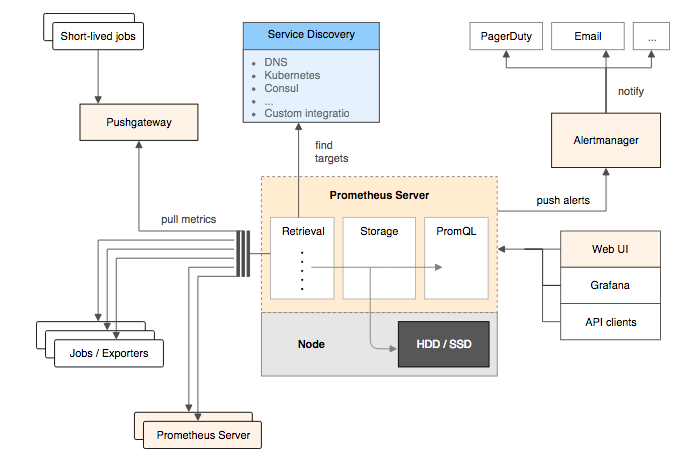

## 比赛题目分析和相关资料调研

### 题目描述

容器是一种应用层抽象，用于将代码和依赖资源打包在一起。多个容器可以在同一台机器上运行，共享操作系统内核。这使得容器的隔离性相对较弱，带来安全上的风险，最严重时会导致容器逃逸，严重影响底层基础设施的保密性、完整性和可用性。

eBPF 是**一个通用执行引擎，能够高效地安全地执行基于系统事件的特定代码，可基于此开发性能分析工具、网络数据包过滤、系统调用过滤，系统观测和分析等诸多场景**。eBPF可以由hook机制在系统调用被使用时触发，也可以通过kprobe或uprobe将eBPF程序附在内核/用户程序的任何地方。

这些机制让eBPF的跟踪技术可以有效地感知容器的各项行为，包括但不限于：

- 容器对文件的访问
- 容器对系统的调用
- 容器之间的互访

请基于eBPF技术开发一个监控工具，该工具可以监控容器的行为，并生成报表（如json文件）将各个容器的行为分别记录下来以供分析。

- **第一题：行为感知**

  编写eBPF程序，感知容器的各项行为。
- **第二题：信息存储**

  在第一题的基础上，令工具可以将采集到的数据以特定的格式保存在本地。
- **第三题：权限推荐（可选）**

  Seccomp是Linux内核的特性，开发者可以通过seccomp限制容器的行为。capabilities则将进程作为root的权限分成了各项更小的权限，方便调控。这两个特性都有助于保障容器安全，但是因为业务执行的逻辑差异，准确配置权限最小集非常困难。请利用上面开发的监控工具，分析业务容器的行为记录报表，然后基于报表自动推荐精准的权限配置最小集。
### 赛题分析
  本赛题分为三个部分，第一部分为编写ebpf程序，感知容器行为，这一部分的关键点在于找到合适的ebpf程序挂载点。挂载点确定后我们可以使用现有的各种ebpf开发框架编写开发代码，完成此部分任务。第二部分信息存储则需要我们将内核态捕捉到的信息传递到用户态，然后在用户态进行输出。这一部分具有较大的可操作空间。我们可以使用最简单的打印方式，将所有数据打印出来，也可以将所有数据存储到日志文件中，还可以通过可视化的手段，将数据进行可视化展示。第三部分则涉及到了一个新的模块Seccomp，seccomp是linux内核中的一个安全模块，可以限制某一进程可以调用的syscall的数量。该技术可以进一步增强本工具的监督保护能力，因此本次也应当将其融合进入本项目。

### 相关资料调研

#### ebpf

eBPF是一项革命性的技术，可以在Linux内核中运行沙盒程序，而无需更改内核源代码或加载内核模块。通过使Linux内核可编程，基础架构软件可以利用现有的层，从而使它们更加智能和功能丰富，而无需继续为系统增加额外的复杂性层。

* 优点：低开销

  eBPF 是一个非常轻量级的工具，用于监控使用 Linux 内核运行的任何东西。虽然 eBPF 程序位于内核中，但它不会更改任何源代码，这使其成为泄露监控数据和调试的绝佳伴侣。eBPF 擅长的是跨复杂系统实现无客户端监控。 
* 优点：安全

  解决内核观测行的一种方法是使用内核模块，它带来了大量的安全问题。而eBPF 程序不会改变内核，所以您可以保留代码级更改的访问管理规则。此外，eBPF 程序有一个验证阶段，该阶段通过大量程序约束防止资源被过度使用，保障了运行的ebpf程序不会在内核产生安全问题。
* 优点：精细监控、跟踪

  eBPF 程序能提供比其他方式更精准、更细粒度的细节和内核上下文的监控和跟踪标准。并且eBPF监控、跟踪到的数据可以很容易地导出到用户空间，并由可观测平台进行可视化。 
* 缺点：很新

  eBPF 仅在较新版本的 Linux 内核上可用，这对于在版本更新方面稍有滞后的组织来说可能是令人望而却步的。如果您没有使用较新版本的 Linux 内核，那么 eBPF 根本不适合您。

#### ebpf 开发工具技术选型

原始的eBPF程序编写是非常繁琐和困难的。为了改变这一现状，llvm于2015年推出了可以将由高级语言编写的代码编译为eBPF字节码的功能，同时，其将 `bpf()` 
等原始的系统调用进行了初步地封装，给出了 `libbpf` 库。这些库会包含将字节码加载到内核中的函数以及一些其他的关键函数。在Linux的源码包的 `samples/bpf/` 目录下，有大量Linux提供的基于 `libbpf` 的eBPF样例代码。一个典型的基于 `libbpf` 的eBPF程序具有 `*_kern.c` 和 `*_user.c` 两个文件，
 `*_kern.c` 中书写在内核中的挂载点以及处理函数， `*_user.c` 中书写用户态代码，完成内核态代码注入以及与用户交互的各种任务。

更为详细的教程可以参考[该视频](https://www.bilibili.com/video/BV1f54y1h74r?spm_id_from=333.999.0.0)。

然而由于该方法仍然较难理解且入门存在一定的难度，因此现阶段的eBPF程序开发大多基于一些工具，比如：

- `BCC`
- `BPFtrace`
- `libbpf`
- `go-libbpf`
- etc

目前使用较多的是 `BCC` 工具，但本项目放弃了 `BCC` ，选择了 `libbpf` 作为我们的开发工具。  

`BCC` 全称为 `BPF Compiler Collection` ，是一个python库，包含了完整的编写、编译、和加载 `BPF` 程序的工具链，以及用于调试和诊断性能问题的工具。自2015年发布以来，`BCC` 经过上百位贡献者地不断完善后，目前已经包含了大量随时可用的跟踪工具。并且 [其官方项目库](https://github.com/iovisor/bcc/blob/master/docs/tutorial.md) 提供了一个方便上手的教程，用户可以快速地根据教程完成 `BCC` 入门工作。用户可以在 `BCC` 上使用Python、Lua等高级语言进行编程。

相较于使用C语言直接编程，这些高级语言具有极大的便捷性，用户只需要使用C来设计内核中的 `BPF` 程序，其余包括编译、解析、加载等工作在内，均可由 `BCC` 完成。

然而使用 `BCC` 存在一个缺点便是在于其兼容性并不好。基于 `BCC` 的 `eBPF` 程序每次执行时候都需要进行编译，编译则需要用户配置相关的头文件和对应实现。在实际应用中，相信大家也会有体会，编译依赖问题是一个很棘手的问题。也正是因此，在本项目的开发中我们放弃了BCC，选择了可以做到一次编译-多次运行的 `libbpf` 工具。

`libbpf-bootstrap` 是一个基于 `libbpf` 库的BPF开发脚手架，从其 [github](https://github.com/libbpf/libbpf-bootstrap) 上可以得到其源码。 `libbpf-bootstrap` 综合了BPF社区过去多年的实践，为开发者提了一个现代化的、便捷的工作流，实现了一次编译，重复使用的目的。

基于 `libbpf` 的BPF程序在编译时会先将 `*.bpf.c` 文件编译为对应的`.o`文件，然后根据此文件生成 `skeleton` 文件，即 `*.skel.h` ，这个文件会包含内核态中定义的一些数据结构，以及用于装载内核态代码的关键函数。在用户态代码 `include` 此文件之后调用对应的装载函数即可将字节码装载到内核中。

我们选择现代 C++ 语言（cpp20）开发 Eunomia 的时候也主要是看中和 libbpf 库以及 bpf 代码的良好兼容性，libbpf 库目前还在迅速更新迭代过程中，我可以直接基于 libbpf 库进行开发，不需要被其他语言（go/rust）的运行时 bpf 库所限制。现代 C++ 的开发速度和安全性应该并不会比其他语言差太多（要是编译提示能像 rust 那样好点就更好了，用了 concept 还是不够好）

#### 容器可观测性

/var/run/docker,sock 是由docker守护进程默认监听的Unix域套接字，容器中的进程可以通过它与守护进程通信。而我们对于docker类容器的观测正是通过docker.sock文件来实现的。通过向该文件发送Http请求，我们可以快速获得所需要的容器相关信息。
倘若我们想获得主机上现有的所有容器，我们可以向容器所在主机ip的`/containers/json`路径发送unix.socket请求，之后解析返回数据，即可获得
目标主机上所有的容器信息。倘若想获得指定容器的信息，只需要在路径中指定容器id即可。例如，如果想得到容器内的进程信息，可以向容器所在主机ip的`/containers/container_id/top`路径发送unix.socket请求，之后解析返回数据，即可以得到容器中的进程信息，其效果和在容器所在主机上运行`docker top container_id`命令一样。

容器中的进程会映射到宿主机中，他们和宿主机上的其他进程最直接的区别就在于namespace。为了隔离资源，容器中的进程和宿主机上的进程具有不同的namespace。因此，监测容器行为可以转变为监测特定进程，通过复用现有process模块的基础上添加container追踪模块。  

容器追踪模块的内核态ebpf代码和process模块一样，都是利用了 `sched_process_exec` 和 `sched_process_exit` 两个挂载点，区别在于用户态代码中对于内核态返回的数据的处理方式。
在容器追踪模块启动之初，其会活动现有的在运行的所有容器中的进程，并存入map中。之后每次内核态捕捉到数据后，我们会判断该进程是否存在于现有的map中，如果存在则直接update其信息。如果不存在，则检查其父进程是否存在，如果父进程存在，并且父进程和该进程的namespace不一致，那么我们会更新其容器信息并存入map。对于没有父进程信息而且之前也不存在于map中的进程，我们会也会将其加入map，并加入其父进程信息。
倘若进程是退出状态，那么我们则会直接将进程从map中删去。

#### 信息可视化展示

`Prometheus` 是一套开源的监控、报警、时间序列数据库的组合，受启发于Google的Brogmon监控系统，2012年开始由前Google工程师在Soundcloud以开源软件的形式进行研发，并且于2015年早期对外发布早期版本。2016年，`Prometheus` 加入了云计算基金会，成为 `kubernetes` 之后的第二个托管项目。其架构如下所示:

  
 
 
Prometheus架构

   

`Prometheus`具有以下特点：
- 可以自定义多维数据模型并且使用metric和
- 存储高效，不依赖分布式存储，支持单节点工作
- 使用灵活且强大的查询语言 `PromQL`
- 通过基于http的pull方式采集时许数据
- 通过push gateway进行序列数据推送

`Grafana` 是一款用Go语言开发的开源数据可视化工具，具有数据监控、数据统计和告警功能，是目前较为流行的一种时序数据展示工具，并且支持目前绝大部分常用的时序数据库。

在本项目中，我们计划将程序捕获到的数据使用 `Prometheus` 进行存储，之后对于存储的数据我们使用 `Grafana` 进行可视化

#### 容器运行时安全

确保容器运行时安全的关键点：

- 使用 `ebpf` 跟踪技术自动生成容器访问控制权限。包括：容器对文件的可疑访问，容器对系统的可疑调用，容器之间的可疑互访，检测容器的异常进程，对可疑行为进行取证。例如：
- 检测容器运行时是否创建其他进程。
- 检测容器运行时是否存在文件系统读取和写入的异常行为，例如在运行的容器中安装了新软件包或者更新配置。
- 检测容器运行时是否打开了新的监听端口或者建立意外连接的异常网络活动。
- 检测容器中用户操作及可疑的 shell 脚本的执行。